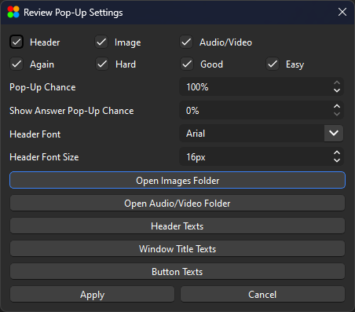
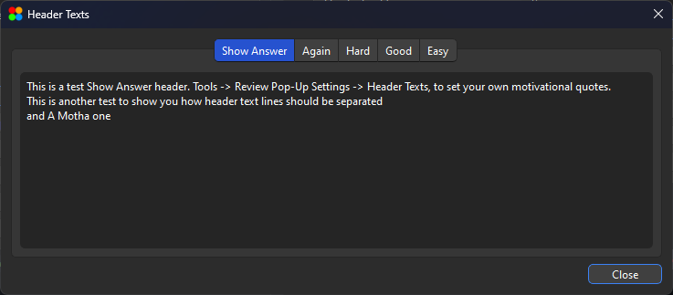
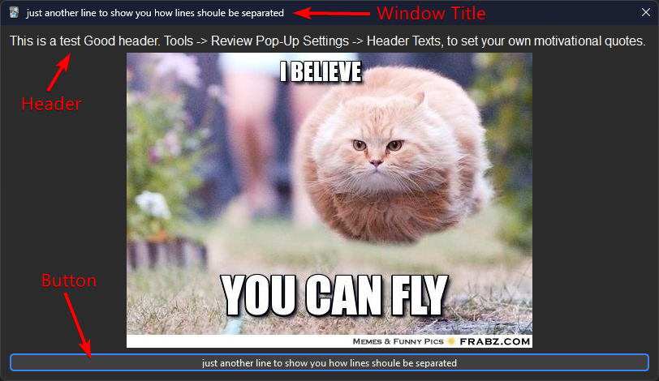

# Anki Review Pop-Up

- [Description](#description)
- [Installation](#installation)
  - [Using AnkiWeb](#using-ankiweb)
  - [Using The .ankiaddon File](#using-the-ankiaddon-file)
  - [Directly copying the add-on to Anki's add-ons folder](#directly-copying-the-add-on-to-ankis-add-ons-folder)
- [Usage](#usage)
  - [General Options](#general-options)
  - [Changing Images and Audio/Video](#changing-images-and-audiovideo)
  - [Changing Pop-Up Texts](#changing-pop-up-texts)
- [Support](#support)
- [Contribution](#contribution)

## Description

This Anki add-on allows users to display pop-up messages when answering flashcards. The pop-ups can contain images, audio, and text, and can be motivational. Users have the option to enable or disable each feature, such as audio, title, and image. The messages and images displayed in the pop-ups are randomly chosen from a list for each button (again, hard, good, and easy).

## Installation

You can use one of the following ways to install Anki Review Pop-Up:

### Using AnkiWeb

The easiest and safest way to install ARBb is through Ankiweb. By installing ARBb through AnkiWeb you can automatically install the version of the add-on that is compatible with your version of Anki; As new version of ARBb may not be compatible with older versions of Anki.

**To install using AnkiWeb follow these steps:**

1. Open [Answer visual + auditory + custom text reinforcement](https://ankiweb.net/shared/info/976516370) add-on page on AnkiWeb and scroll to the download section.

- You can see the supported versions of Anki in the download section of the add-on on AnkiWeb.

2. Copy the code that's in download section.

- Instead of going to AnkiWeb you can copy `976516370` and follow the steps 3 and 4.

3. Open anki, go to `Tools > Add-ons` and then click on `Get Add-ons...`
4. Paste the code that you copied from AnkiWeb there and click on `Ok`

### Using the .ankiaddon file

This is also an easy way to install ARBb but it doesn't guarantee that the version of the add-on that you install will be compatible with your version of anki. If you're using older versions of Anki I don't recommend you install the add-on using the add-on file.

If you want to install and specific version or an older version of the add-on, I recommend you use the `*.ankiaddon` file.

**To install using .ankiaddon file follow these steps:**

1. Go to [Rleases page](https://github.com/noobj2/Anki-Review-PopUp/releases) and find the version of the add-on that you want.
2. Click on the `*.ankiaddon` file and download it (you might have click on `Assets` to be able to see the `*.ankiaddon` file)
3. Locate the `*.ankiaddon` file on your PC and double click to install.

### Directly copying the add-on to Anki's add-ons folder

If you're not able to install the add-on using `AnkiWeb` and `.ankiaddon`, you can download the source code and copy it to the Anki add-ons folder.

**To install by directly copying add-on files to Anki add-ons folder follow these steps:**

1. Go to [Rleases page](https://github.com/noobj2/Anki-Review-PopUp/releases) and find the version of the add-on that you want.
2. Click on the `Source code (zip)` file and download it (you might have click on `Assets` to be able to see the `Source code (zip)` file)
3. Extract the zip file and copy the folder inside it to `C:\Users\YOUR_USERNAME\AppData\Roaming\Anki2\addons21`

- You might need to re-name the extracted folder and delete the version code from the folder name. The folder containing the add-on files should be `Anki-Review-Pop-Up` instead of `Anki-Review-Pop-Up.VERSION_TAG`.

- To open Anki add-ons folder you also can go to `Tools > Add-ons` and then click on `View Files`

## Usage

Once the add-on is installed, you can access the add-on's settings menu in the tools menu. Go to "Tools > Reveiw Pop-Up Settings", and you should see the settings menu.

### General Options

- Checking/un-checking `Header`, `Image`, and `Audio/Video` options, enables/disables each option in the review pop-up.
- You can choose to show the review pop-up on specific answer buttons by selecting only the desired answer buttons (Again, Hard, Good, and Easy).
- You can change the possibility of a pop-up showing by changing the value of the `Pop-Up Chance`.
- You can Change the possibility of a pop-up showing on pressing `Show Answer` button. Setting the value on `%0`, disables the feature.
- You can change the font family and font size for the header text by tweaking `Header Font` and `Header Font Size` Options.

### Changing Images and Audio/Video

By clicking on `Open Images Folder` Button in the settings menu, the folder containing the images should automatically open. That folder should contain 5 other folders; labeled `again`, `hard`, `good`, `easy`, and `show_answer`. Copy your images to these folders and then restart anki. The add-on shoule now show your new images for each button.

The smae thing happens when you click on `Open Audio/Video Folder`.

### Changing Pop-Up Texts

By clicking on `Header Texts` the bellow window shoule open.

There are 5 tabs in the window; each containing the texts for a specific button. You can add your custom texts. Each message should be on a separate line as demonstrated using the default texts.

Clicking on each of the `Window Title Texts` and `Button Texts` a similar window should open.

In the image bellow you can see what each option changes.

## Support

For any issues or questions related to the add-on, users can refer to the Anki add-on repository for support and documentation.
By using this add-on, users can enhance their Anki flashcard experience with customizable pop-up messages containing images, audio, and text.

## Contribution

- You can request new features or report bugs in the [Issues](https://github.com/noobj2/Anki-Review-PopUp/issues) section.

- You can improve the add-on or add new features or fix bugs if you want. Any pull request will be much appreciated.

- You can also rate this add-on [here](https://ankiweb.net/shared/review/976516370) if you like the add-on.
